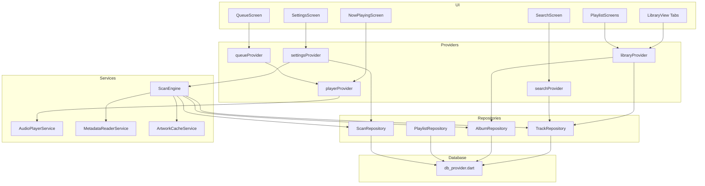

# Design Document — Cadenza Phase 1 MVP

## Overview

Cadenza Phase 1 is an offline-first local music player for Android and Windows built on Flutter 3.x. The architecture is deliberately layered: a persistence layer (SQLite via `db_provider.dart`) sits at the bottom, repositories provide typed data access, services encapsulate scanning and playback logic, Riverpod providers bridge the data and UI layers, and feature screens consume those providers. No networking or cloud dependencies exist anywhere in the stack.

The two platforms share identical Dart business logic but diverge at well-defined seams:

- **Database bootstrap**: `sqflite` (Android/iOS) vs `sqflite_common_ffi` (Windows) — hidden behind `db_provider.dart`.
- **Library scan**: `on_audio_query` / MediaStore (Android) vs recursive filesystem walk (Windows) — hidden behind `ScanEngine` interface.
- **Background audio**: `audio_service` foreground service + media notifications (Android) vs plain `just_audio` session (Windows).

All platform forks are guarded with `Platform.isAndroid` / `Platform.isWindows` checks and never leak across layers.

### Design Goals

| Goal | Target |
|---|---|
| Cold scan of 5 k tracks | < 30 s on Ryzen 5 5600 |
| Warm-start to library | < 2 s |
| Zero-change rescan writes | 0 rows |
| Gapless transition gap | ≤ 200 ms |
| Background playback (Android) | Survives backgrounding + screen lock |
| Data survival | Force-close → relaunch with full library |


---

## Architecture

### Layer Diagram

```
┌─────────────────────────────────────────────────────────────────┐
│                         UI Layer                                │
│  LibraryView  NowPlaying  Queue  Playlists  Search  Settings    │
└──────────────────────┬──────────────────────────────────────────┘
                       │  consumes
┌──────────────────────▼──────────────────────────────────────────┐
│                    Riverpod Providers                           │
│  libraryProvider  playerProvider  searchProvider  settingsProvider│
└──┬─────────────────────────┬───────────────────────────────────┘
   │ reads/writes             │ drives
┌──▼─────────────┐  ┌────────▼────────────────────────────────────┐
│  Repositories  │  │               Services                      │
│  TrackRepo     │  │  AudioPlayerService   ScanEngine            │
│  AlbumRepo     │  │  MetadataReaderService  ArtworkCacheService │
│  PlaylistRepo  │  └────────┬────────────────────────────────────┘
│  ScanRepo      │           │ reads file system / media store
└──┬─────────────┘           │ reads/writes
   │ SQL                     │
┌──▼─────────────────────────▼──────────────────────────┐
│                    Database Layer                      │
│   db_provider.dart  →  sqflite (Android)              │
│                     →  sqflite_common_ffi (Windows)   │
│   schema.dart  (DDL, indexes, migration stubs)        │
└───────────────────────────────────────────────────────┘
```

### Component Dependency Graph (Mermaid)




---

## Components and Interfaces

### DbProvider (`core/database/db_provider.dart`)

The sole entry point to SQLite. Selects backend at runtime, runs schema DDL on first open, exposes a raw `Database` handle to repositories.

```dart
abstract class DbProvider {
  Future<Database> get database;
  static DbProvider instance = _createPlatformProvider();
}

class AndroidDbProvider implements DbProvider { /* uses sqflite */ }
class WindowsDbProvider implements DbProvider { /* uses sqflite_common_ffi */ }
```

**Initialization sequence:**

1. Detect platform (`Platform.isAndroid` / `Platform.isWindows`).
2. Resolve DB file path via `path_provider.getApplicationDocumentsDirectory()`.
3. Open with `openDatabase(path, onCreate: _runSchema, version: 1)`.
4. `_runSchema` executes all `CREATE TABLE IF NOT EXISTS` and `CREATE INDEX IF NOT EXISTS` statements from `schema.dart`.
5. If open fails, propagate `DatabaseInitException` — the app's root widget catches this and renders an error screen before navigating to the library.

**Schema DDL** lives in `schema.dart` as a single constant string list, executed in order. All tables use `IF NOT EXISTS` so re-entrant opens are safe.

---

### TrackRepository (`core/repositories/track_repository.dart`)

All CRUD for the `tracks`, `albums`, and `artists` tables.

```dart
abstract class TrackRepository {
  Future<List<Track>> getAllTracks({bool includeMissing = false});
  Future<Track?> getTrackByPath(String filePath);
  Future<int> upsertTrack(Track track);          // INSERT OR REPLACE
  Future<int> markMissing(String filePath);      // sets is_missing = 1
  Future<int> markFound(String filePath);        // sets is_missing = 0
  Future<ScanStats> getScanStats();              // inserts/updates/unchanged counts
}
```

Key implementation notes:

- `upsertTrack` uses `INSERT OR REPLACE` keyed on `file_path UNIQUE`.
- All list queries filter `WHERE is_missing = 0` by default; `includeMissing: true` lifts the filter.
- `getAllTracks` returns results sorted `ORDER BY title COLLATE NOCASE`.
- The repository does **not** batch internally — callers (ScanEngine) drive batching and pass a `Batch` object when needed for performance.

---

### AlbumRepository (`core/repositories/album_repository.dart`)

```dart
abstract class AlbumRepository {
  Future<List<Album>> getAllAlbums();
  Future<List<Track>> getTracksForAlbum(int albumId);
  Future<void> upsertAlbumFromTrack(Track track); // INSERT OR IGNORE on (name, album_artist)
}
```

Albums are never created directly by users — only via `upsertAlbumFromTrack` called by `ScanEngine` after each track write. The `UNIQUE(name, album_artist)` constraint guarantees idempotence.

---

### PlaylistRepository (`core/repositories/playlist_repository.dart`)

```dart
abstract class PlaylistRepository {
  Future<List<Playlist>> getAllPlaylists();
  Future<Playlist?> getPlaylistById(int id);
  Future<List<Track>> getTracksForPlaylist(int playlistId);

  Future<int> createPlaylist(String name);         // throws DuplicateNameException
  Future<void> renamePlaylist(int id, String name); // throws DuplicateNameException
  Future<void> deletePlaylist(int id);             // cascades to playlist_tracks

  Future<void> addTrackToPlaylist(int playlistId, int trackId);
  Future<void> removeTrackAtPosition(int playlistId, int position);
  Future<void> reorderTracks(int playlistId, List<int> newTrackIdOrder);
}
```

**Position management** is handled entirely inside `PlaylistRepository` using a SQLite transaction. After any removal, a single `UPDATE playlist_tracks SET position = position - 1 WHERE playlist_id = ? AND position > ?` reindexes subsequent rows. `reorderTracks` assigns new positions atomically via a batch inside a transaction.

---

### ScanEngine — Interface + Platform Implementations

```dart
abstract class ScanEngine {
  /// Returns a stream of [ScanProgress] events.
  Stream<ScanProgress> scan(List<ScanFolder> folders);
}

class AndroidScanEngine implements ScanEngine { /* on_audio_query */ }
class WindowsScanEngine implements ScanEngine { /* dart:io recursive walk */ }
```

The concrete class is injected via Riverpod's `scanEngineProvider`, which reads `Platform.isAndroid` once at startup.

**ScanProgress model:**

```dart
class ScanProgress {
  final int discovered;
  final int processed;
  final int inserted;
  final int updated;
  final int unchanged;
  final int missing;
  final bool isComplete;
}
```

---

### MetadataReaderService (`core/services/metadata_reader_service.dart`)

```dart
abstract class MetadataReaderService {
  Future<TrackMetadata> readMetadata(String filePath);
}
```

**Fallback chain:**

1. Try `flutter_media_metadata` → `MetadataRetriever.setDataSource(filePath)`.
2. If that throws or returns all-null fields, try `id3` package tag parser.
3. If both fail, log the failure and return a `TrackMetadata` with all fields `null` (the track is still inserted, just untagged). The scan does **not** abort.

**NULL policy:** Any field absent in the file is stored as `null` in the DB — never an empty string, never a placeholder like `"Unknown Artist"`. UI layers handle null display.

---

### ArtworkCacheService (`core/services/artwork_cache_service.dart`)

```dart
abstract class ArtworkCacheService {
  /// Returns the cached file path, or null if artwork absent.
  Future<String?> cacheArtwork(String trackFilePath, Uint8List? artworkBytes);
  String artworkCacheDir();
}
```

Artwork is extracted by `MetadataReaderService`, then passed to `ArtworkCacheService` which:

1. Computes `sha1(trackFilePath)` as the cache key.
2. Writes `<cacheDir>/<sha1>.jpg` if not already present (avoids redundant writes for same-album tracks).
3. Returns the file path stored in `tracks.artwork_path`.

Cache directory: `path_provider.getApplicationSupportDirectory()/artwork_cache/`. This directory is excluded from backup on Android via `android:allowBackup="false"` on the cache path.

---

### AudioPlayerService (`core/services/audio_player_service.dart`)

Wraps `just_audio` (`AudioPlayer`) and `audio_service` (`AudioHandler`) into a single facade. On Android, extends `BaseAudioHandler` to support background foreground-service playback. On Windows, wraps `AudioPlayer` directly (no background service needed for desktop).

```dart
abstract class AudioPlayerService {
  // Playback state
  Stream<PlaybackState> get playbackStateStream;
  Stream<Track?> get currentTrackStream;
  Stream<Duration> get positionStream;

  // Controls
  Future<void> playQueue(List<Track> tracks, {int startIndex = 0});
  Future<void> playNext(Track track);
  Future<void> pause();
  Future<void> resume();
  Future<void> skipToNext();
  Future<void> skipToPrevious();  // applies 3-second rule
  Future<void> seekTo(Duration position);

  // Queue mutation
  Future<void> reorderQueue(int oldIndex, int newIndex);
  Future<void> removeFromQueue(int index);

  // Queue state
  Stream<List<Track>> get queueStream;
}
```

**Gapless mechanism:** `playQueue` builds a `ConcatenatingAudioSource` from `AudioSource.uri(...)` entries and calls `player.setAudioSource(concatenating)`. Skip operations call `player.seekToNext()` / `player.seekToPrevious()` on the existing source — the underlying `ConcatenatingAudioSource` handles gapless buffering. Manual track sequencing via `onPlayerComplete` listeners is explicitly avoided.

**Skip-previous logic:**

```dart
Future<void> skipToPrevious() async {
  final pos = player.position;
  if (pos != null && pos.inSeconds > 3) {
    await player.seek(Duration.zero);
  } else {
    await player.seekToPrevious();
  }
}
```

